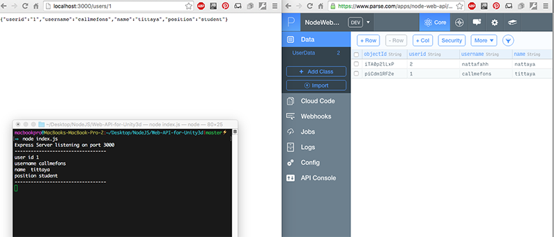
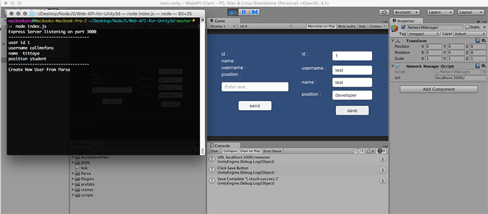

## Node JS Web API with Unity 5.3
This just the basics of building a game that allows connecting and usage of REST endpoints. I've used a framework like express to create a Node Server and Parse SDK with Unity

------------------

### Setup

##### Main Repository
1. `git clone https://github.com/cfcfon/NodeJS-WebAPI-Unity.git`
2. `cd NodeJs-WebAPI-Unity`
3. `copy a directory WebAPI Client to Unity3D Engine`
4. `npm install`
5. `node index.js`
